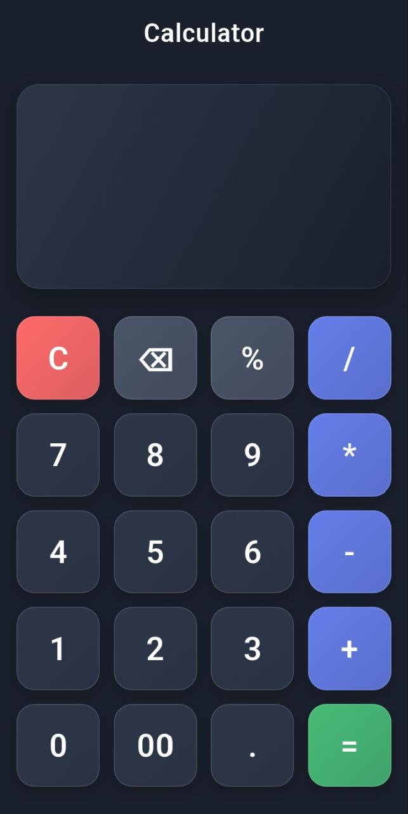

# Calculator App

<div align="center">
  
  <br><br>
  <h3>A clean, basic calculator built with Flutter</h3>
</div>

Clean and elegant calculator application made with **Flutter**. Supports basic arithmetic, percentages, parentheses and a beautiful dark-themed UI.

## ✨ Features
- Basic operations: +, −, ×, ÷
- Percentage calculations (%)
- Parentheses support
- Clear (C) and decimal point
- Double-zero (00) button for faster input
- Modern dark design (Material You inspired)
- Responsive layout

## 🚀 Quick Start

```bash
# 1. Clone this repository
git clone https://github.com/Fouad-developer/calculator.git

# 2. Go to project folder
cd calculator

# 3. Install dependencies
flutter pub get

# 4. Run the app (connect phone or open emulator)
flutter run
